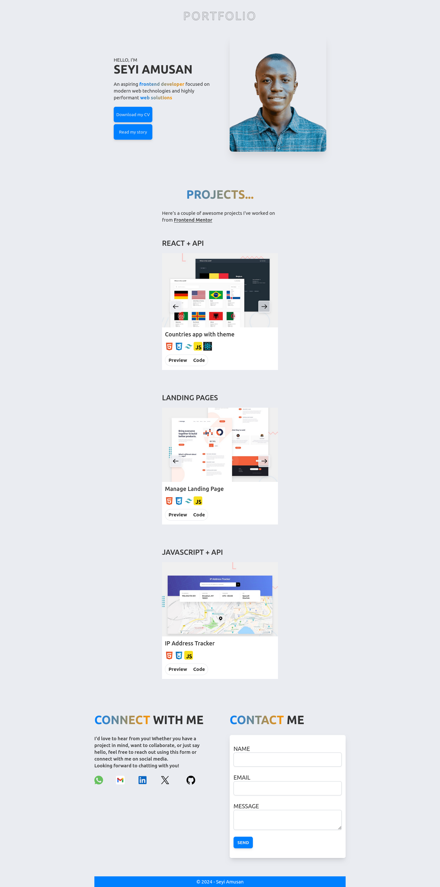

# Portfolio Website

This is my personal portfolio website, showcasing my skills, projects, and experience as an **aspiring frontend developer**. The project is built using **Tailwind CSS** for responsive design and utility-first styling.

## Features

- **Responsive Design**: The site is fully responsive across all devices (mobile, tablet, desktop).
- **Modern UI/UX**: Clean and intuitive design to present my work in an attractive way.
- **Interactive Elements**: Dynamic content such as animations, hover effects, and transitions.
- **Tailwind CSS**: Styled using Tailwind CSS for a streamlined development process.

## Tech Stack

- **HTML5**
- **Tailwind CSS**
- **JavaScript** 

## Installation and Setup

To run this project locally, follow these steps:

1. Clone the repository:

    ```bash
    git clone https://github.com/seyi-amusan/portfolio.git
    ```

2. Navigate to the project directory:

    ```bash
    cd portfolio
    ```

3. Install the dependencies (if any):

    ```bash
    npm install
    ```

4. Run the project locally:

    ```bash
    npm run dev
    ```

Your website should now be running on `http://localhost:3000`.


## Screenshots



## Contributing

If you'd like to contribute to this project, feel free to fork the repository and create a pull request with improvements or suggestions.

## Contact

For any questions or feedback, feel free to reach out to me at:

- **LinkedIn**: [My LinkedIn Profile](https://www.linkedin.com/in/seyi-amusan-414895294/)
- **Portfolio**: [Portfolio livesite](https://seyi-amusan.github.io/portfoio)

---

Thank you for checking out my portfolio website!
